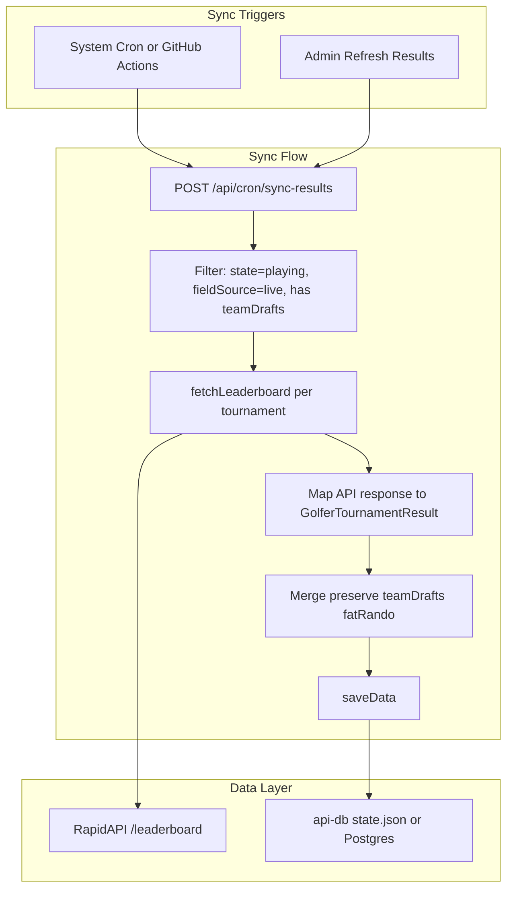

# Auto-Pull Golfer Results from RapidAPI

**Deployment context**: Production runs on a **Digital Ocean droplet** (PM2, Nginx). See [DEPLOY.md](DEPLOY.md). Do not assume Vercel or serverless platforms. Cron uses system cron on the droplet or GitHub Actions.

---

## Current State

- **Field (golfers)**: Already auto-fetched from RapidAPI via `fetchTournamentField()` in [FrontEnd/lib/live-golf-api.ts](FrontEnd/lib/live-golf-api.ts) when `fieldSource === 'live'`
- **Results**: Stored in `data.results[tournamentId]`, read-only from [FrontEnd/app/api/tournaments/[id]/results/route.ts](FrontEnd/app/api/tournaments/[id]/results/route.ts). No RapidAPI integration.
- **Leaderboard API**: RapidAPI Live Golf Data exposes `GET /leaderboard?orgId=1&tournId=&year=` (used in [FrontEnd/scripts/test-slash-golf-api.ts](FrontEnd/scripts/test-slash-golf-api.ts)). Response has `leaderboardRows` / `leaderboard` / `players` and optional `rounds` metadata.

---

## Non-Disruption Guarantees (Live Draft Protection)

The results sync must **never** touch draft-related data. The first tournament's live draft must not be disrupted.

| Data | Sync behavior |
|------|---------------|
| `data.golfers[tournamentId]` | **Never touched.** Field stays exactly as imported. |
| `data.draftStates[tournamentId]` | **Never touched.** Draft state preserved. |
| `data.results[tournamentId].teamDrafts` | **Preserved.** Merge logic keeps existing. |
| `data.results[tournamentId].fatRandoStolenGolfers` | **Preserved.** Merge logic keeps existing. |
| `data.results[tournamentId].golferResults` | **Replaced** with mapped API data. |
| `data.results[tournamentId].teamScores` | **Recalculated** from teamDrafts + golferResults. |

**When sync runs**: Only for `state === 'playing'` or `state === 'completed'`. **Never** during `state === 'draft'`.

**Merge precondition**: Sync only when `results[tournamentId]?.teamDrafts?.length > 0`. Skip otherwise.

**Import Field vs Refresh Results**:
- **Import from Live API**: Wipes `draftStates` and `teamDrafts`. Use only before draft starts. Add warning when draft exists.
- **Refresh results from Live API** (new): Updates `golferResults` and `teamScores` only. Safe during/after play.

---

## Architecture

---

## Implementation Plan

### 1. Leaderboard API Integration

**Add `fetchLeaderboard` to [FrontEnd/lib/live-golf-api.ts](FrontEnd/lib/live-golf-api.ts)**

- Call `GET /leaderboard?orgId=1&tournId=&year=` using existing `fetchFromApi` and `LIVE_API_TOURNAMENT_MAP`
- Return raw response for mapping layer (schema may vary; handle `leaderboardRows`, `leaderboard`, `players`)

**Schema discovery**: Run `npm run test-slash-golf` and capture a real leaderboard response.

### 2. Leaderboard-to-Results Mapper

**New module: `FrontEnd/lib/leaderboard-mapper.ts`**

- Input: raw leaderboard response + tournament (for `cutLineScore` when needed)
- Output: `GolferTournamentResult[]` matching [FrontEnd/lib/types.ts](FrontEnd/lib/types.ts)

**Mapping logic:**

- **Golfer ID**: Use `playerId` from leaderboard (must match field)
- **Rounds**: Map `round1`, `round2`, etc. to `{ round, score, toPar }`. Handle partial rounds.
- **Cut (API-first)**: If API provides cut status per golfer (`madeCut`, `cut`, `status: 'CUT'`, etc.), **use it directly**. No calculation.
- **Cut (fallback)**: Only use `cutLineScore` when API does not provide cut status.
- **WD**: Map `status === 'WD'` to `status: 'withdrawn'`, `madeCut: false`
- **Points**: Compute only when results are final. Use [FrontEnd/lib/constants.ts](FrontEnd/lib/constants.ts) `pointsFromPosition`.

### 2a. Cut Detection (Has Cut vs No Cut)

- **Schedule**: `hasCut(tournament) = tournament.cutLineScore != null`. Add helper in [FrontEnd/lib/tournament-utils.ts](FrontEnd/lib/tournament-utils.ts).
- **No-cut events** (TOUR Championship, Presidents Cup): `cutLineScore` omitted; all golfers `madeCut: true`.
- **Mapper flow**: (1) If API provides cut status → use it. (2) If `!hasCut` → all `madeCut: true`. (3) Fallback: `cutLineScore` for dummy/seed/edge cases.

### 3. Merge Strategy

- **Preserve**: `teamDrafts`, `fatRandoStolenGolfers`
- **Replace**: `golferResults`
- **Recalculate**: `teamScores` via [FrontEnd/lib/dummyData.ts](FrontEnd/lib/dummyData.ts) `calculateTeamScoresFromDrafts`

Only sync when: `state === 'playing'` (or `completed`), `fieldSource === 'live'`, `results[tournamentId]?.teamDrafts?.length > 0`.

### 4. Cron API Route

**New route: `FrontEnd/app/api/cron/sync-results/route.ts`**

- Method: `POST`
- Auth: `x-major-pain-cron-secret` or `Authorization: Bearer <secret>` matching `CRON_SECRET`
- Logic: getData → filter tournaments → fetchLeaderboard → map → merge → saveData
- Return: `{ synced: string[], errors: string[] }`

### 5. Scheduling and API Call Budget

**Deployment: Digital Ocean droplet.** Use system cron on the droplet or GitHub Actions. Do not use Vercel Cron.

**Strategy: sync only on playing days**

- **Playing days**: Typically Thu–Sun. Can extend to Mon for playoffs/weather.
- **Cron schedule**: Thu, Fri, Sat, Sun, Mon only. No sync on Tue–Wed.
- **Per sync**: 1 API call per in-progress tournament. 0 calls when none playing.
- **Estimate**: ~4–6 syncs per tournament × 1 call = ~35–55 calls/season.

**Cron options (Digital Ocean):**

- **System cron on droplet**: Add to crontab, e.g. `0 4 * * 4-0` (4am UTC Thu–Sun) or `0 4 * * 4-1` (Thu–Mon). Run: `curl -X POST -H "Authorization: Bearer $CRON_SECRET" https://majorpain.devinhansen.com/api/cron/sync-results`
- **GitHub Actions**: `.github/workflows/sync-results.yml` with `cron: '0 4 * * 4,5,6,0,1'` (Thu–Mon 4am UTC). POST to the API with secret.
- **External cron** (cron-job.org, etc.): Configure Thu–Mon only.

**Early exit**: Sync route filters by `state === 'playing'`. If no tournament is playing, 0 API calls.

### 6. Admin Manual Refresh

**Add "Refresh results from Live API" button** on [FrontEnd/app/admin/tournaments/[id]/page.tsx](FrontEnd/app/admin/tournaments/[id]/page.tsx)

- Calls `POST /api/admin/tournaments/[id]/sync-results`
- **Disable when `state === 'draft'`** to avoid confusion
- Add warning on "Import from Live API" when `draftStates[tournamentId]` exists: "This will reset the draft. Only use before draft starts."

### 6a. Admin Page: Cut Line Score Field

When using Live API, cut status comes from the leaderboard. The **Cut Line Score** field:

- **Purpose**: Testing (dummy/seed, `apply-cut-line-score` script) and fallback when API lacks cut info.
- **When `fieldSource === 'live'`**: Add helper text: "When using Live API, cut status comes from the data. This field is only used for dummy data and when the API doesn't provide cut info."
- **Keep the field** for backward compatibility and testing.

### 7. Round 2 Complete for Substitutions

Data shape supports it: `rounds.length >= 2` per golfer. Substitution logic can check `activeGolfers.every(gid => golferResults.find(r => r.golferId === gid)?.rounds?.length >= 2)`.

---

## Files to Create/Modify

| File | Action |
|------|--------|
| `FrontEnd/lib/tournament-utils.ts` | Add `hasCut(tournament)` helper |
| `FrontEnd/lib/live-golf-api.ts` | Add `fetchLeaderboard(tournamentId)` |
| `FrontEnd/lib/leaderboard-mapper.ts` | New: map API → `GolferTournamentResult[]` |
| `FrontEnd/app/api/cron/sync-results/route.ts` | New: cron endpoint |
| `FrontEnd/app/api/admin/tournaments/[id]/sync-results/route.ts` | New: admin single-tournament sync |
| `FrontEnd/app/admin/tournaments/[id]/page.tsx` | Add "Refresh results" button; update Cut Line helper text; Import warning; disable Refresh during draft |
| `FrontEnd/.env.example` | Add `CRON_SECRET` |
| `.github/workflows/sync-results.yml` or server crontab | Cron schedule (Thu–Mon) |

---

## Risks and Mitigations

- **API schema drift**: Defensive mapping with multiple field-name fallbacks.
- **Golfer ID mismatch**: Verify `/tournament` and `/leaderboard` use same `playerId`.
- **Presidents Cup / match play**: Skip or stub; out-of-scope for v1.
