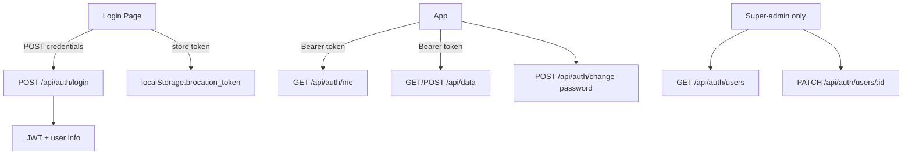

# Per-Player Login Implementation Guide

This document summarizes exactly how per-player (individual user) login was implemented for the Brocation Board project. Use it as a blueprint to replicate the same authentication system in another project.

---

## Overview

**Before:** Single shared username/password; one `localStorage` flag for "authenticated."

**After:** Each user has their own account (username + password). JWT-based auth, admin/super-admin roles, User Management for super-admin to grant admin rights and set temporary passwords.

---

## Architecture



---

## 1. Dependencies

Add to `package.json`:

```json
"bcrypt": "^5.1.1",
"jsonwebtoken": "^9.0.2"
```

---

## 2. Database

### Migration: Users Table

Create `migrations/003_users.sql`:

```sql
CREATE TABLE IF NOT EXISTS brocation_users (
  id SERIAL PRIMARY KEY,
  player_id INT NOT NULL UNIQUE CHECK (player_id >= 1 AND player_id <= 12),
  username VARCHAR(64) NOT NULL UNIQUE,
  password_hash VARCHAR(255) NOT NULL,
  is_admin BOOLEAN NOT NULL DEFAULT false,
  is_super_admin BOOLEAN NOT NULL DEFAULT false,
  force_password_change BOOLEAN NOT NULL DEFAULT false,
  created_at TIMESTAMPTZ DEFAULT NOW(),
  updated_at TIMESTAMPTZ DEFAULT NOW()
);

CREATE INDEX IF NOT EXISTS brocation_users_username ON brocation_users (username);
CREATE INDEX IF NOT EXISTS brocation_users_player_id ON brocation_users (player_id);
```

**Adapt:** Replace `player_id` with your entity ID (e.g. `user_id`, `member_id`). Adjust the CHECK constraint for your ID range.

### Migration: Ensure Super-Admin

Create `migrations/004_super_admin_devin.sql`:

```sql
UPDATE brocation_users SET is_super_admin = true, is_admin = true WHERE player_id = 3;
```

**Adapt:** Use your super-admin's ID. This ensures they remain super-admin even after re-seeding.

---

## 3. Auth Module

Create `server/auth.js`:

- **JWT:** `signToken(payload)`, `verifyToken(token)` — use `JWT_SECRET` from env, read at runtime (not module load) so dotenv has loaded.
- **Password:** `hashPassword(plain)`, `comparePassword(plain, hash)` — bcrypt with 10 rounds.
- **Middleware:** `requireAuth(pool)` — validates JWT, loads user from DB, sets `req.auth = { playerId, username, isAdmin, isSuperAdmin }`.
- **Middleware:** `requireSuperAdmin` — returns 403 if `req.auth.isSuperAdmin` is false.
- **Helper:** `getBearerToken(req)` — extracts `Authorization: Bearer <token>`.

**Critical:** Load `JWT_SECRET` lazily (inside functions), not at module top-level, or dotenv may not have run yet.

---

## 4. Backend Routes

Add to your Express server (e.g. `server/index.js`):

| Route | Auth | Description |
|-------|------|-------------|
| `POST /api/auth/login` | none | Body: `{ username, password }`. Lowercase username. Return `{ token, playerId, playerName, isAdmin, isSuperAdmin, forcePasswordChange }`. |
| `GET /api/auth/me` | requireAuth | Return current user from `req.auth` plus playerName from your data. |
| `GET /api/auth/users` | requireAuth + requireSuperAdmin | Return list of users with `playerId`, `username`, `playerName`, `isAdmin`, `isSuperAdmin`. |
| `PATCH /api/auth/users/:playerId` | requireAuth + requireSuperAdmin | Body: `{ is_admin?, password?, forcePasswordChange? }`. Prevent super-admin from revoking own admin. |
| `POST /api/auth/change-password` | requireAuth | Body: `{ currentPassword, newPassword }`. Verify current, hash new, update DB, clear `force_password_change`. |

Add `Access-Control-Allow-Headers: Authorization` to CORS.

**getPlayerName:** You need a helper that maps `player_id` → display name. Brocation uses data from a JSON blob; adapt to your data source.

---

## 5. Seed Script

Create `scripts/seed-users.js`:

- Define your users (id, name). Username = lowercase name.
- Set `is_super_admin = true` for the super-admin, `is_admin` as needed.
- Use `BROCATION_INITIAL_PASSWORD` env or default `ChangeMe123`.
- INSERT with `ON CONFLICT (player_id) DO UPDATE` to preserve `is_admin` and `is_super_admin` on re-seed.
- Hash passwords with bcrypt before insert.

---

## 6. Migrate Script

Create `scripts/migrate.js`:

- Run 003_users.sql
- Run seed-users.js
- Run 004_super_admin_devin.sql (after seed so rows exist)

Add to `package.json`:

```json
"migrate": "node scripts/migrate.js"
```

---

## 7. Frontend: Login

Replace shared-credential login with:

- `POST /api/auth/login` with `{ username, password }`
- On success: `localStorage.setItem('brocation_token', data.token)` and `localStorage.setItem('brocation_authenticated', 'true')`
- Call `onLogin({ playerId, playerName, isAdmin, isSuperAdmin, forcePasswordChange })`

---

## 8. Frontend: App

- **Auth state:** Replace simple `isAuthenticated` with `currentUser` (playerId, playerName, isAdmin, isSuperAdmin, forcePasswordChange).
- **On load:** If token exists, call `GET /api/auth/me`; on 401, clear token and show Login. Store response in `currentUser`.
- **Logout:** Clear `localStorage.brocation_token` and `brocation_authenticated`.
- **Admin:** Remove shared admin password. Admin access = `currentUser.isAdmin`. Show Admin tab/link only when `isAdmin`.
- **Force password change:** If `forcePasswordChange`, show Change Password modal before allowing access.

---

## 9. Frontend: Change Password

- Modal with: current password, new password, confirm.
- `POST /api/auth/change-password` with `Authorization: Bearer <token>`.
- On success, close modal and clear `forcePasswordChange` in state.

---

## 10. Frontend: User Management (Super-Admin Only)

- **Visibility:** Only when `currentUser.isSuperAdmin`.
- **List:** Fetch `GET /api/auth/users`, show list of users. Tap to open modal.
- **Modal:** For selected user: Grant/Revoke admin button, Set temporary password (input + "Force change on next login" checkbox).
- **Self-protection:** When editing self and super-admin, do not allow "Revoke admin" — show "Super-admin (cannot revoke)" instead.
- **PATCH:** Call `PATCH /api/auth/users/:playerId` with `{ is_admin }` or `{ password, forcePasswordChange }`.

---

## 11. Footer / Identity

- Show "LOGGED IN AS [USER]" with gear icon.
- Tap opens action sheet (mobile) or modal (desktop).
- Options: Admin Settings (if admin), Change password, Logout.

---

## 12. Environment Variables

| Variable | Purpose |
|----------|---------|
| `JWT_SECRET` | Sign/verify JWTs. Long random string. |
| `DATABASE_URL` | Postgres connection. |
| `BROCATION_INITIAL_PASSWORD` | Optional. Default temp password for seed. |

---

## 13. Deployment Checklist

1. Add `JWT_SECRET` to production env.
2. Run migration: `psql $DATABASE_URL -f migrations/003_users.sql`
3. Run seed: `node scripts/seed-users.js` (or `npm run migrate` if you added it)
4. Run 004: `psql $DATABASE_URL -f migrations/004_super_admin_devin.sql`
5. Rebuild frontend, restart server.

---

## 14. Usernames

- Stored and compared in lowercase.
- Login normalizes input: `String(username).trim().toLowerCase()`.

---

## 15. Files Touched (Brocation)

| File | Role |
|------|------|
| `migrations/003_users.sql` | Users table |
| `migrations/004_super_admin_devin.sql` | Ensure super-admin |
| `server/auth.js` | JWT, bcrypt, middleware |
| `server/index.js` | Auth routes |
| `scripts/seed-users.js` | Seed users |
| `scripts/migrate.js` | One-command setup |
| `src/Login.jsx` | Login form → API |
| `src/App.jsx` | currentUser, User Management, Change Password modal, footer |
| `package.json` | bcrypt, jsonwebtoken, migrate script |
| `.env.example` | JWT_SECRET |

---

## 16. Revert

If needed, a git tag (`pre-per-player-login`) can mark the previous stable build. To revert: checkout that tag, rebuild, restart. New installs will need the old shared credentials again.
