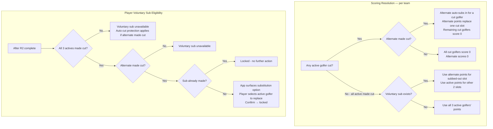

# Alternates and Substitutions Plan

## Current State Summary

**What exists:**

- **Auto cut substitution**: When an active golfer misses the cut, the alternate's points replace them. Implemented in [FrontEnd/scripts/apply-cut-line-score.ts](FrontEnd/scripts/apply-cut-line-score.ts), [FrontEnd/lib/dummyData.ts](FrontEnd/lib/dummyData.ts) (`calculateTeamScoresFromDrafts`), and table view logic.
- **TeamDraft** already has `substitutions?: Array<{ round: number; replacedGolferId: string; replacementGolferId: string }>` in [FrontEnd/lib/types.ts](FrontEnd/lib/types.ts) (lines 90-94) but it is **never used** in scoring.
- **Admin** can edit team drafts (Active 1/2/3, Alternate) via [FrontEnd/app/admin/tournaments/[id]/page.tsx](FrontEnd/app/admin/tournaments/[id]/page.tsx) and set golfer result status (active/cut/withdrawn) in Golfer Results.
- **Display**: [FrontEnd/components/tournament/PlayerCards.tsx](FrontEnd/components/tournament/PlayerCards.tsx) uses status `'out' | 'alt' | 'cut' | 'wd'` for text color; `'out'` is never set in data layer.

**What's missing:**

1. Voluntary substitution (player-detected and confirmed after round 2, when eligible)
2. Scoring logic that respects `substitutions` array
3. Clear golfer states: subbed_out, and consistent use of active/alternate/cut/withdrawn
4. Admin UI to set substitutions and golfer states per team
5. Admin override for manual assignment (assign golfer to multiple teams when fixing errors)

---

## 1. Golfer State Model

**Two layers:**

| Layer                             | Purpose                | Values   |
| --------------------------------- | ---------------------- | -------- |
| **GolferTournamentResult.status** | Tournament-wide result | `active` |
| **Per-team display state**        | Role + substitution    | `active` |

**Derivation:**

- **active**: In `activeGolfers`, no substitution replaces them, and (madeCut or substituted-by-alternate)
- **alternate**: In `alternateGolfer` slot
- **subbed_out**: In `activeGolfers` but has voluntary substitution (alternate replaced them)
- **cut**: In `activeGolfers`, `madeCut === false`, no substitution
- **withdrawn**: `status === 'withdrawn'` in GolferTournamentResult

**Type updates:**

- Extend `PlayerCardRow['golfers'][].status` in [FrontEnd/lib/data.ts](FrontEnd/lib/data.ts) to include `'subbed_out'` (or reuse `'out'`).
- Ensure `GolferResultStatus` stays `'active' | 'cut' | 'withdrawn'` (tournament result only).

---

## 2. Scoring Logic (Use Substitutions)

**Files to update:**

- [FrontEnd/lib/dummyData.ts](FrontEnd/lib/dummyData.ts) – `calculateTeamScoresFromDrafts`
- [FrontEnd/scripts/apply-cut-line-score.ts](FrontEnd/scripts/apply-cut-line-score.ts)
- [FrontEnd/app/tournament/[id]/table/page.tsx](FrontEnd/app/tournament/[id]/table/page.tsx) – `getPlayerTableData`
- [FrontEnd/lib/data.ts](FrontEnd/lib/data.ts) – `getPlayerCardsForTournament`

**Logic:**
For each of the 3 scoring slots (from `activeGolfers`):

1. Check `substitutions` for an entry with `replacedGolferId === activeGolferId` and `round >= 2`.
2. If found → use `replacementGolferId` (alternate) for points.
3. Else if active golfer cut/withdrawn → use alternate for points (existing behavior).
4. Else → use active golfer’s points.

Effective scoring lineup = 3 golfers (mix of original actives and alternate when substituted).

---

## 3. Voluntary Substitution – Player Interface

**Voluntary sub vs. auto cut protection — mutually exclusive:**

- If **any** active golfer on the team missed the cut AND the alternate made the cut → alternate auto-subs in for a cut golfer. Voluntary substitution is not available.
- If **all** active golfers made the cut AND the alternate made the cut → voluntary substitution is available (player’s choice). Auto cut protection does not apply.

These two paths never occur simultaneously for the same team.

**Eligibility conditions (all must be true):**

1. Round 2 is complete (any golfer has `rounds.length >= 2`)
2. All 3 of the player’s active golfers made the cut
3. The alternate made the cut
4. No voluntary substitution has already been made for this player this tournament

**Reversibility:**

- Non-admin players: voluntary sub is **locked** once confirmed. No undo.
- Admin: can modify or remove any substitution at any time via the admin interface.

**Where to add UI:**

- Inline on [FrontEnd/app/tournament/[id]/list/page.tsx](FrontEnd/app/tournament/[id]/list/page.tsx) – the app detects eligibility and surfaces the substitution option on the current user’s card when all conditions are met.

**API:** New endpoint `PATCH /api/tournaments/[id]/substitution`:

- Auth: require current user matches `playerId`.
- Body: `{ playerId, replacedGolferId, replacementGolferId }` (replacement = alternate).
- Validation: all eligibility conditions above; reject if voluntary sub already exists for this player.
- Persist: append to `teamDrafts[playerId].substitutions` and recalc `teamScores` via admin state PATCH.

**UI flow:**

- When eligible, show substitution option on the player’s own card.
- Player selects which active golfer to swap out, confirms.
- Call API. Lock UI (no further sub option shown). Update local cache and re-render.

---

## 4. Data Layer – Substitution State in Display

**Files:** [FrontEnd/lib/data.ts](FrontEnd/lib/data.ts) – `getPlayerCardsForTournament`

For each golfer in the list:

- If in `activeGolfers` and has voluntary substitution → `status: 'out'`.
- If in `activeGolfers` and cut/wd → `status: 'cut'` or `'wd'`.
- If `alternateGolfer` and not scoring → `status: 'alt'`.
- If `alternateGolfer` and scoring (auto or voluntary sub) → `status: undefined` (white, in play).
- If in `activeGolfers` and scoring (no sub, made cut) → `status: undefined` (white, active).

**Display rules for voluntarily subbed-out golfers (both list and table views):**

- Color: `#707070` (grey) — uses existing `'out'` status
- Prefix: `{rank}: Name` — position is still shown so the player can see how the subbed-out golfer would have affected their score
- This works automatically: `'out'` falls through to the rank prefix in the existing text logic in both `PlayerCards.tsx` and `PlayerTables.tsx`

**Component changes needed:**

- `PlayerCards.tsx`: No change — `'out'` → grey is already handled.
- `PlayerTables.tsx`: Add `'out'` to `GolferTableData.status` type and `getGolferTextColor` (currently only handles `'cut' | 'wd' | 'alt'`).

---

## 5. Admin Interface Enhancements

**A. Substitutions per team**

In [FrontEnd/app/admin/tournaments/[id]/page.tsx](FrontEnd/app/admin/tournaments/[id]/page.tsx) Team Drafts section:

- For each draft, show current substitutions (replaced → replacement, round).
- Add “Add substitution” to choose: replace which active golfer with alternate.
- Allow remove substitution.
- Persist via existing `saveTeamDrafts` (include `substitutions` in payload).

**B. Golfer states for all players**

- Golfer Results already has per-golfer status (active/cut/withdrawn). Keep as-is.
- Substitutions are per-team and edited in Team Drafts.
- Optional: bulk “Set all cut” / “Set all withdrawn” for specific golfers across results.

**C. Manual team assignment**

- Current UI: GolferTypeahead with `excludeIds` = other teams’ golfers. Admin cannot assign same golfer to two players.
- Add “Admin override” toggle: when on, pass `excludeIds={[]}` so any golfer can be assigned. Show warning: “Override mode: same golfer can be on multiple teams. Use only for manual fixes.”
- Enforce max 4 golfers (3 active + 1 alternate) in `updateDraftGolfer` and validation.

---

## 6. API for Player Substitution

**New route:** `FrontEnd/app/api/tournaments/[id]/substitution/route.ts`

- `PATCH`: Apply voluntary substitution.
- Load state via `getData()`, find `results[tournamentId]`, update `teamDrafts` for the player, recalc `teamScores`, save via `saveData()`.
- Require write secret or authenticated user matching `playerId` (depending on auth setup).

---

## 7. Round 2 Detection

**Helper:** `isAfterRound2(results: TournamentResult): boolean`

- Return `results.golferResults.some(gr => (gr.rounds?.length ?? 0) >= 2)`.

Use in: substitution API, player substitution UI (show/hide controls), notification trigger.

---

## 8. Substitution Window

The voluntary substitution window is open between round 2 completion and the start of round 3.

**Window closes:** Midnight at the end of day 2 of the tournament (i.e. `tournamentStartDate + 2 days` at `00:00` local time = start of Saturday morning).

- Applies to all standard tournaments — PGA events always run Thursday–Sunday, so day 3 is always Saturday.
- Ryder Cup is exempt — no substitutions in that format.
- This deadline is enforced in both the substitution API (reject requests after cutoff) and the player UI (hide the substitution option after cutoff).

**Helper:** `isSubWindowOpen(tournament: Tournament): boolean`

- Calculate cutoff as `new Date(tournament.startDate)` + 2 days, set to midnight.
- Return `new Date() < cutoff`.

---

## 9. Push Notifications for Voluntary Substitution

**Trigger:** During the `syncResultsFromLiveApi` call in `/api/cron/sync-results`, after round 2 results are written.

**Logic:**

1. Check `isAfterRound2(results)` — if false, skip notifications.
2. For each human player (not Fat Rando), check voluntary sub eligibility:
  - All 3 active golfers made the cut
  - Alternate made the cut
  - No voluntary sub already recorded for this player
  - Substitution window is still open
3. If eligible AND a sub notification has not already been sent for this player this tournament → send push notification.
4. Record that the notification was sent so it doesn't repeat on future syncs.

**Notification content:** Prompt the player that they have a substitution decision to make before Saturday morning.

**Tracking:** Add a `subNotificationSent?: string[]` field (array of playerIds) to the tournament result state. Set it when a notification is sent; check it before sending.

**No notification if:** Any active golfer was cut (auto cut protection applies — no decision needed), alternate missed the cut, or sub already made.

**Ryder Cup:** Skip entirely — no substitutions.

---

## 10. File Change Summary

| File                                                      | Changes                                                                                                  |
| --------------------------------------------------------- | -------------------------------------------------------------------------------------------------------- |
| `FrontEnd/lib/types.ts`                                   | Add `subNotificationSent?: string[]` to tournament result state                                          |
| `FrontEnd/lib/dummyData.ts`                               | Update `calculateTeamScoresFromDrafts` to use substitutions                                              |
| `FrontEnd/scripts/apply-cut-line-score.ts`                | Use substitutions when computing team scores                                                             |
| `FrontEnd/lib/data.ts`                                    | Derive `'out'` status for voluntarily subbed-out golfers; add `isAfterRound2`, `isSubWindowOpen` helpers |
| `FrontEnd/components/tournament/PlayerCards.tsx`          | No change — `'out'` → grey already handled                                                               |
| `FrontEnd/components/tournament/PlayerTables.tsx`         | Add `'out'` to `GolferTableData.status` type and `getGolferTextColor`                                    |
| `FrontEnd/app/tournament/[id]/table/page.tsx`             | Use substitutions in golfer/points resolution                                                            |
| `FrontEnd/app/tournament/[id]/list/page.tsx`              | Player substitution UI (app-detected, inline on player's own card)                                       |
| `FrontEnd/app/admin/tournaments/[id]/page.tsx`            | Substitutions UI; admin override toggle; persist substitutions                                           |
| `FrontEnd/app/api/tournaments/[id]/substitution/route.ts` | New – PATCH for voluntary substitution; enforce window cutoff                                            |
| `FrontEnd/lib/sync-results.ts`                            | After round 2 sync, check eligibility per player and send sub notifications; track sent state            |

---

## 11. Mermaid: Substitution Flow

---

## 12. Implemented: Table View Status Colors and Display

The tournament table view now matches the list view for cut, WD, and alternate styling. The following has been implemented.

### 12.1 Status Colors (matches list view)

In [FrontEnd/components/tournament/PlayerTables.tsx](FrontEnd/components/tournament/PlayerTables.tsx):

- **Cut golfers**: `#ae6161` (red)
- **WD golfers**: `#ae6161` (red)
- **Alternate golfers**: `#ae9661` (gold)
- **Default (active)**: `#ffffff` (white)

`GolferTableData` includes optional `status?: 'cut' | 'wd' | 'alt'`. A helper `getGolferTextColor(status)` returns the correct color.

### 12.2 Alternate Substituted In = Default Color

When the alternate is substituted in for a cut/WD golfer (their points count for the team), the alternate row shows **default** (white) instead of gold. The alternate is considered "in play" and no longer visually distinct as a bench player.

**Logic:** `alternateSubstitutedIn` is true when:

- At least one active golfer missed the cut, and
- The alternate made the cut

When true, the alternate row gets `status: undefined` (default color) instead of `status: 'alt'` (gold).

**Applied in** [FrontEnd/app/tournament/[id]/table/page.tsx](FrontEnd/app/tournament/[id]/table/page.tsx):

- Regular teams (has results and no-results branches)
- Fat Rando (both branches, including placeholder-alternate push)

### 12.3 Where status is set

| Golfer type                   | status value           |
| ----------------------------- | ---------------------- |
| Active, made cut              | `undefined`            |
| Active, missed cut            | `'cut'`                |
| Active, withdrawn             | `'wd'`                 |
| Alternate, not substituted in | `'alt'`                |
| Alternate, substituted in     | `undefined`            |
| Fat Rando 4th golfer          | Same rule as alternate |

---

## 13. Resolved Questions

1. **Auth for substitution API**: The app has per-player JWT auth. The substitution API authenticates the requesting player and ensures `playerId` matches the token.
2. **Fat Rando voluntary sub**: Auto-subs the golfer with the worst position after round 2 if alternate is available. Separate from player voluntary sub; not in scope for this plan.
3. **No-cut events**: Voluntary sub is available after round 2 regardless of whether the event has a cut. Same eligibility logic applies (alternate made cut / is still active).
4. **One sub per tournament**: Each player has one alternate and gets one voluntary sub per tournament. Once made, it is locked for non-admin players.
5. **Mutual exclusivity**: Voluntary sub and auto cut protection never apply to the same team simultaneously. If any active golfer is cut, auto protection takes over and voluntary sub is unavailable.

